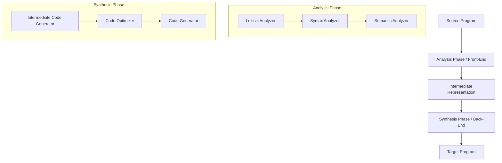

# Question 1 Solutions

**i. What is the main function of a compiler?**
**Answer:** b) Convert high-level code to machine code

**ii. What are the major data structures used in a compiler?**
**Answer:** Major data structures used in a compiler include:
1. **Symbol Table**: Used to store information about identifiers (variables, functions, classes, etc.) such as their type, scope, and memory location.
2. **Abstract Syntax Tree (AST)**: A tree representation of the abstract syntactic structure of the source code.
3. **Parse Tree**: A tree representing the syntactic structure of a string according to some context-free grammar.
4. **Token List**: A list or stream of tokens generated by the lexical analyzer.
5. **Control Flow Graph (CFG)**: Used in code optimization and generation to represent all paths that might be traversed through a program during its execution.
6. **Literal Table**: Stores constants and strings used in the program to save space and avoid redundancy.

**iii. Differentiate between single-pass and multi-pass compilers.**
**Answer:**

| Feature | Single-Pass Compiler | Multi-Pass Compiler |
| :--- | :--- | :--- |
| **Definition** | A compiler that passes through the source code only once. | A compiler that processes the source code or intermediate representation multiple times (passes). |
| **Speed** | Faster, as it only scans the code once. | Slower, as it scans the code multiple times. |
| **Memory Usage** | Requires less memory, as it translates as it reads. | Requires more memory to store intermediate representations between passes. |
| **Optimization** | Limited scope for optimization since it doesn't have a global view of the code. | Can perform extensive machine-independent and machine-dependent optimizations. |
| **Forward References** | Cannot handle forward references easily (e.g., using a variable before it's declared) without special tricks. | Can easily resolve forward references since it goes over the code in subsequent passes. |
| **Complexity** | Simpler to implement but restricts language features. | More complex and modular design (front-end, middle-end, back-end). |

**iv. Describe the analysis-synthesis model of compilation and illustrate it with a clear diagram.**
**Answer:**
The analysis-synthesis model of compilation divides the compilation process into two broad phases: Analysis (Front-end) and Synthesis (Back-end).

1. **Analysis Phase (Front-end):**
   - This phase reads the source program, breaks it down into its constituent parts, and creates an intermediate representation (IR) of the source program.
   - It primarily focuses on understanding the structure and meaning of the source code.
   - It detects any syntax and semantic errors and provides meaningful error messages.
   - The major steps include Lexical Analysis (scanning), Syntax Analysis (parsing), and Semantic Analysis.

2. **Synthesis Phase (Back-end):**
   - This phase takes the intermediate representation (IR) generated by the analysis phase and synthesizes the target program (machine code or assembly code).
   - It focuses on translating the IR into an optimized equivalent target program.
   - The major steps include Intermediate Code Generation (often overlapping with analysis), Code Optimization, and Target Code Generation.

**Diagram:**


**OR**

**iv. Develop a LEX program to recognize and categorize keywords, identifiers, and numerical values from a given input.**
**Answer:**
```lex
%{
#include <stdio.h>
%}

/* Simple Definitions */
DIGIT    [0-9]
LETTER   [a-zA-Z]
ID       {LETTER}({LETTER}|{DIGIT})*
NUM      {DIGIT}+(\.{DIGIT}+)?

%%
"int"|"float"|"if"|"else"|"while"|"for"|"return" {
    printf("KEYWORD: %s\n", yytext);
}

{ID}    { printf("IDENTIFIER: %s\n", yytext); }
{NUM}   { printf("NUMBER: %s\n", yytext); }

[ \t\n]+ { /* Ignore whitespace */ }
.       { printf("UNKNOWN: %s\n", yytext); }
%%

int yywrap() { return 1; }

int main() {
    yylex();
    return 0;
}
```

**Explanation of the Code:**
1. **`%{ ... %}` (C Declarations):** This block contains standard C code. We include `<stdio.h>` here so we can use `printf` to print our output to the screen.
2. **Definitions Section:** This section sets up shortcuts (regular expressions) to make the next part cleaner.
   - `DIGIT [0-9]`: Matches any single number from 0 to 9.
   - `LETTER [a-zA-Z]`: Matches any single uppercase or lowercase letter.
   - `ID {LETTER}({LETTER}|{DIGIT})*`: An identifier (variable name) *must* start with a letter, followed by zero or more (`*`) letters or digits.
   - `NUM {DIGIT}+(\.{DIGIT}+)?`: A number is one or more digits. The `(\.{DIGIT}+)?` part says it *optionally* (`?`) can have a decimal point followed by more digits (e.g., `12.34`).
3. **`%% ... %%` (Rules Section):** This is where we tell Lex what to do when it finds a match. It checks these top-to-bottom.
   - `"int"|"float"...`: The `|` means OR. If it finds any of these exact words, it prints "KEYWORD". `yytext` is a built-in Lex variable that holds the exact text that was matched.
   - `{ID}` and `{NUM}`: If it matches our definitions for variables or numbers, it prints them.
   - `[ \t\n]+`: This matches one or more spaces, tabs (`\t`), or newlines (`\n`). The empty brackets `{ /* Ignore */ }` mean "do nothing", effectively skipping whitespace.
   - `.`: The dot matches *any* single character that wasn't matched by the rules above (like `@`, `!`, `;`). We catch these and print "UNKNOWN".
4. **C Code Section (Bottom):**
   - `int yywrap() { return 1; }`: A mandatory function for Lex. Returning `1` tells Lex that there's only one input file to read (when it hits the end of the input, it should stop).
   - `int main()`: The starting point of the program. Calling `yylex();` starts the scanning process we defined above.
