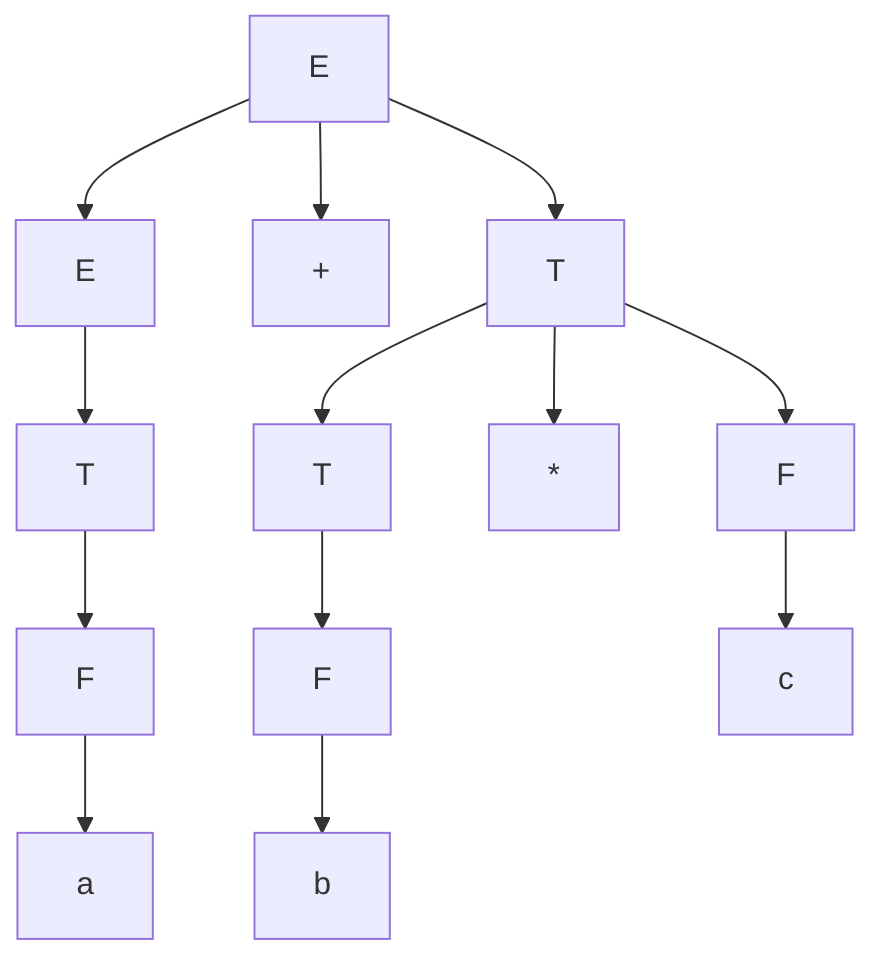

# Question 2 Solutions

**i. A syntax tree is primarily used for:**
**Answer:** b) Representing abstract syntactic structure

**ii. What is Context-Free Grammar (CFG)? Provide an example.**
**Answer:**
A Context-Free Grammar (CFG) is a formal grammar in which every production rule is of the form `A -> α`, where `A` is a single non-terminal symbol, and `α` is a string of terminals and/or non-terminals (can be empty). It is used to describe the syntax of programming languages.
**Example:** A CFG for simple arithmetic expressions.
```
E -> E + E
E -> E * E
E -> (E)
E -> id
```

**iii. Explain the top down and bottom up parser with the types.**
**Answer:**
**Top-Down Parser:**
A top-down parser attempts to construct a parse tree for an input string starting from the root (start symbol) and proceeding downwards to the leaves (the tokens of the string). It works by applying grammar rules recursively to expand non-terminals until the input string is derived.
**Types of Top-Down Parsers:**
1. **Recursive Descent Parser:** Uses a set of recursive procedures (one for each non-terminal) to parse the input. It may require backtracking.
2. **Predictive Parser (e.g., LL(1)):** A non-backtracking top-down parser that uses a parsing table to determine which production to apply based on the current non-terminal and the next lookahead token.

**Bottom-Up Parser:**
A bottom-up parser starts with the input string (leaves of the parse tree) and attempts to reduce it to the start symbol (root of the parse tree). It works by finding substrings that match the right side of a production rule and replacing them with the non-terminal on the left side (a reduction).
**Types of Bottom-Up Parsers:**
1. **Shift-Reduce Parser:** A basic form that uses a stack to hold grammar symbols and an input buffer, performing "shift" (push token to stack) and "reduce" (replace right-hand side with left-hand side) operations.
2. **LR Parsers (Left-to-right, Rightmost derivation):**
   - **LR(0):** Simplest, no lookahead.
   - **SLR(1) (Simple LR):** Uses FOLLOW sets to make parsing decisions.
   - **LALR(1) (Look-Ahead LR):** Merges states of LR(1) with the same core, widely used (e.g., YACC).
   - **CLR(1) (Canonical LR):** Most powerful, uses 1 token lookahead for all items, resulting in a large number of states.
3. **Operator Precedence Parser:** A bottom-up parser that can only be applied to operator grammars. It uses precedence relations between operators to guide parsing.

**iv. Solve the following problems-**
**a) Construct the First and Follow sets for the following grammar**
`S -> aAB`
`A -> bA | ε`
`B -> c`

**Answer:**
**FIRST Sets:**
- **FIRST(S)** = `{ a }`  (Since S always starts with terminal 'a')
- **FIRST(A)** = `{ b, ε }` (From A -> bA, FIRST is 'b'. From A -> ε, FIRST is ε)
- **FIRST(B)** = `{ c }` (From B -> c, FIRST is 'c')

**FOLLOW Sets:**
- **FOLLOW(S)** = `{ $ }` (Start symbol always contains $)
- **FOLLOW(A)**: From S -> aAB, FIRST(B) is in FOLLOW(A). FIRST(B) = `{c}`. So, **FOLLOW(A)** = `{ c }`
- **FOLLOW(B)**: From S -> aAB, B is at the end of the production, so FOLLOW(S) is in FOLLOW(B). FOLLOW(S) = `{$}`. So, **FOLLOW(B)** = `{ $ }`

**b) Construct a syntax tree for the string a + b * c using the following grammar:**
`E -> E + T | T`
`T -> T * F | F`
`F -> a | b | c`

**Answer:**
**Derivation (Leftmost):**
```
E => E + T
  => T + T
  => F + T
  => a + T
  => a + T * F
  => a + F * F
  => a + b * F
  => a + b * c
```

**Syntax Tree:**


**OR**

**iv. How would you construct operator precedence parser for the following grammar and parse the below string:**
`S -> (L)/a`
`L -> L,S/S`
`String: (a,(a,a))`

**Answer:**
**1. Terminals and Operators:**
The terminals are: `(`, `)`, `a`, `,`. We add `$` as the end marker.

**2. Precedence Relations Table:**
Let's define precedence relations (`<.`, `>.`, `=.`) based on typical operator precedence for this list structure:
- `=.` holds between `(` and `)`
- `<.` holds between `,` and `a`, `(`, etc. (giving precedence to operations inside the list)

| | `a` | `(` | `)` | `,` | `$` |
|---|---|---|---|---|---|
| **`a`** | | | `>.` | `>.` | `>.` |
| **`(`** | `<.`| `<.`| `=.`| `<.`| |
| **`)`** | | | `>.` | `>.` | `>.` |
| **`,`** | `<.`| `<.`| `>.` | `>.` | |
| **`$`** | `<.`| `<.`| | | |

*(Empty cells indicate errors)*

**3. Parsing the string `(a,(a,a))`**
(Showing stack with terminals only as non-terminals are ignored in operator precedence relation lookups).

| Stack (Terminals) | Input | Relation | Action |
| :--- | :--- | :--- | :--- |
| `$` | `( a , ( a , a ) ) $` | `$ <. (` | Shift |
| `$ (` | `a , ( a , a ) ) $` | `( <. a` | Shift |
| `$ ( a` | `, ( a , a ) ) $` | `a >. ,` | Reduce `a` to `S` |
| `$ (` | `, ( a , a ) ) $` | `( <. ,` | Shift |
| `$ ( ,` | `( a , a ) ) $` | `, <. (` | Shift |
| `$ ( , (` | `a , a ) ) $` | `( <. a` | Shift |
| `$ ( , ( a` | `, a ) ) $` | `a >. ,` | Reduce `a` to `S` |
| `$ ( , (` | `, a ) ) $` | `( <. ,` | Shift |
| `$ ( , ( ,` | `a ) ) $` | `, <. a` | Shift |
| `$ ( , ( , a` | `) ) $` | `a >. )` | Reduce `a` to `S` |
| `$ ( , ( ,` | `) ) $` | `, >. )` | Reduce `S , S` to `L` |
| `$ ( , (` | `) ) $` | `( =. )` | Shift |
| `$ ( , ( )` | `) $` | `) >. )` | Reduce `( L )` to `S` |
| `$ ( ,` | `) $` | `, >. )` | Reduce `S , S` to `L` |
| `$ (` | `) $` | `( =. )` | Shift |
| `$ ( )` | `$ ` | `) >. $` | Reduce `( L )` to `S` |
| `$` | `$ ` | Accept | Accept |
