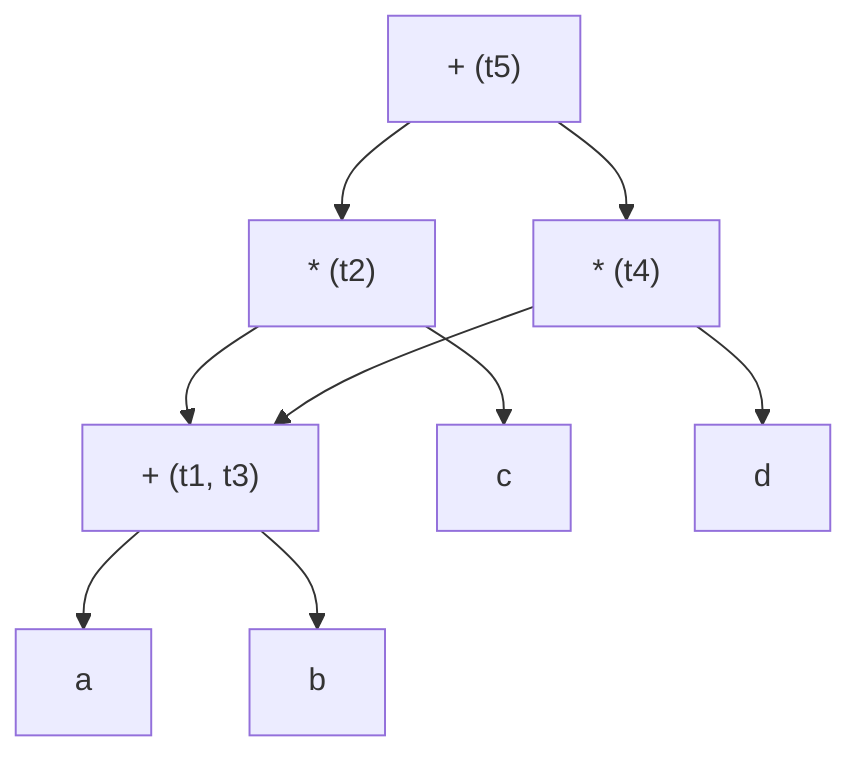

# Question 4 Solutions

**i. Peephole optimization is applied to:**
**Answer:** D) Assembly code
*(Note: Peephole optimization is typically a machine-dependent optimization applied to target code or assembly code just before final generation.)*

**ii. Generate three-address code for the following assignment statement:**
`A=(B+C)*(D-E)`
**Answer:**
```
t1 = B + C
t2 = D - E
t3 = t1 * t2
A = t3
```

**iii. Construct a Directed Acyclic Graph (DAG) for the following basic block:**
`t1 = a + b`
`t2 = t1 * c`
`t3 = a + b`
`t4 = t3 * d`
`t5 = t2 + t4`

**Answer:**
Notice that `a + b` is computed twice. The DAG will reuse the node for `a + b` to eliminate the common subexpression.
- `t1` and `t3` share the same node since they both compute `a + b`.



**iv. Explain the role of machine-dependent and machine-independent optimizations in code generation.**
**Answer:**
**Machine-Independent Optimizations:**
- **Role:** These optimizations are applied to the intermediate representation (IR) of the program and do not rely on the specific architecture of the target machine. Their primary goal is to improve the fundamental logic and algorithmic efficiency of the code, reducing overall execution time and space without considering hardware specifics.
- **Techniques:**
  - Common Subexpression Elimination: Removing redundant calculations.
  - Dead Code Elimination: Removing code that does not affect the program's outcome.
  - Loop Optimizations: Such as code motion (moving loop-invariant code out), loop unrolling, and strength reduction.
  - Constant Folding and Propagation.

**Machine-Dependent Optimizations:**
- **Role:** These optimizations are performed during or after the target code generation phase. They heavily rely on the specifics of the target hardware architecture, such as the instruction set, number of registers, memory hierarchy, and pipeline structure. The goal is to maximize the utilization of hardware resources.
- **Techniques:**
  - Register Allocation: Efficiently assigning frequently used variables to CPU registers to minimize memory access times.
  - Instruction Scheduling: Reordering instructions to prevent pipeline stalls and ensure CPU functional units are kept busy.
  - Peephole Optimization: Examining a short sequence of target instructions (a "peephole") and replacing them with a shorter or faster equivalent sequence (e.g., replacing `add r1, 0` with nothing).

**OR**

**iv. How would you generate three address codes for:**
```c
x=1;
i=1;
while (i<=n)
{
   x=x*2;
   i=i+1;
}
```

**Answer:**
**Three Address Code (TAC):**
```
1. x = 1
2. i = 1
3. L1: if i > n goto L2   // Loop condition, exit if false
4. t1 = x * 2             // Start of loop body
5. x = t1
6. t2 = i + 1
7. i = t2
8. goto L1                // Loop back to condition
9. L2: ...                // Code after loop
```
*(Alternatively, you can test the positive condition and jump into the loop)*
